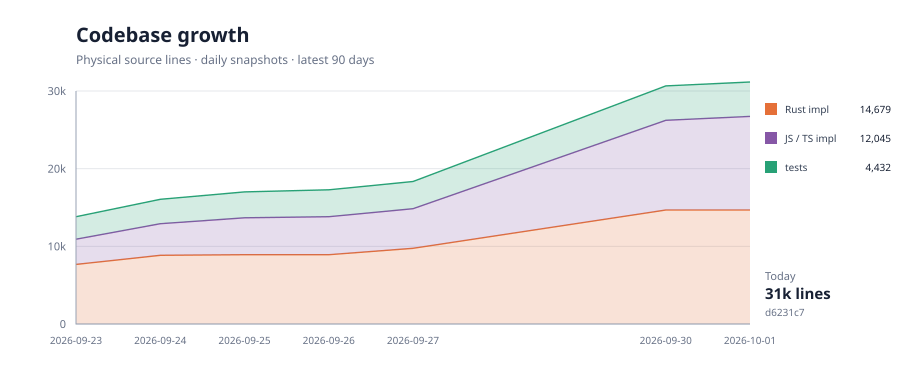
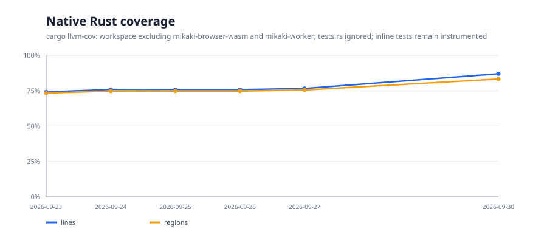

# Mikaki

Mikaki is an experimental passkey identity service built primarily in Rust. It combines a portable WebAuthn verifier with a shared account and OpenID Connect login for applications. Its owner Vault supports encrypted names and typed notes, with separately consented AI exports and sharing. Newer Vault and agent flows have local test evidence; deployment and recovery gates remain. Vault screens include unsaved-edit protection, deletion confirmation, a local idle/absolute display lock, and session checks on tab return; see the [session lifecycle and its limits](docs/session-lifecycle.md).

> **Development prototype:** The OP Worker and one administrator account are deployed. One web RP and one native public client are registered. Signed Android ordinary OIDC login and app return are verified; the web RP flow and remaining native qualification gates are open. Do not use Mikaki to protect real user accounts. See [project status](docs/status.md) for verified behavior and release gaps.

## Start here

| Task                             | Guide                                                                                                                                                    |
| -------------------------------- | -------------------------------------------------------------------------------------------------------------------------------------------------------- |
| Run locally                      | [Getting started](docs/getting-started.md)                                                                                                               |
| Integrate an application         | [RP integration](docs/rp-integration.md)                                                                                                                 |
| Review the product UI            | [Login preview](docs/login-ui-preview.md), [Vault and account screens](docs/product-ui-preview.md), and [product quality gates](docs/product-quality.md) |
| Review test coverage and CI      | [Product test evidence and limits](docs/test-quality.md)                                                                                                 |
| Prepare release or recovery      | [Verified Worker upload inputs, migration rehearsal and operating gates](docs/release-and-recovery.md)                                                   |
| Understand the design            | [Architecture](docs/architecture.md) and [decisions](docs/adr/README.md)                                                                                 |
| Operate a deployment             | [Cloudflare deployment](docs/cloudflare-deployment.md)                                                                                                   |
| Browse current and proposed work | [Documentation](docs/README.md) and [roadmap](docs/roadmap.md)                                                                                           |

Changes are recorded in the [changelog](CHANGELOG.md). Report vulnerabilities through the [security policy](SECURITY.md). The project is available under [MIT](LICENSE-MIT) or [Apache-2.0](LICENSE-APACHE), at your option.

## Project metrics

The charts track implementation and test code size and native Rust coverage. See the [measurement scope](metrics/README.md) and [dependency inventory](metrics/dependency-inventory.md) for what they include.

