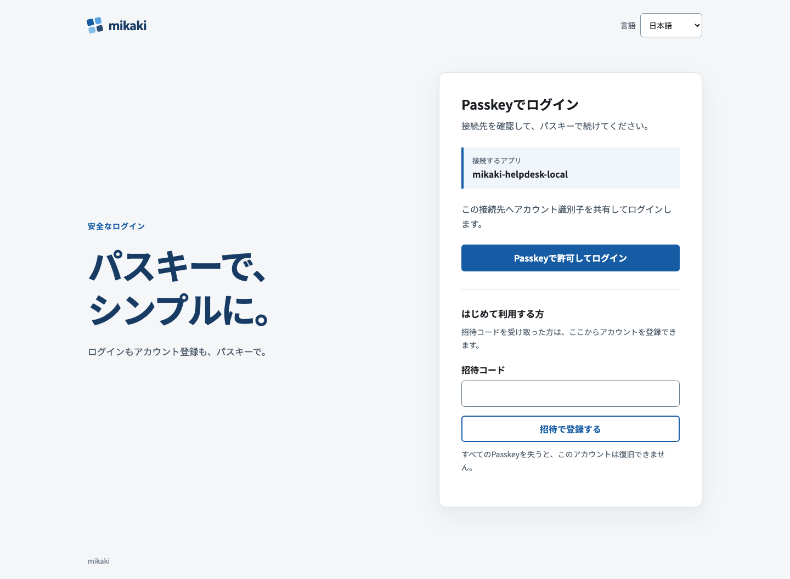
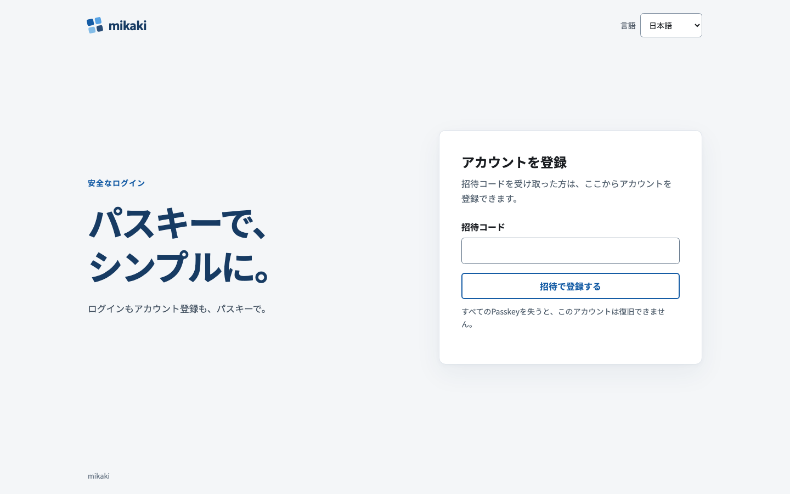
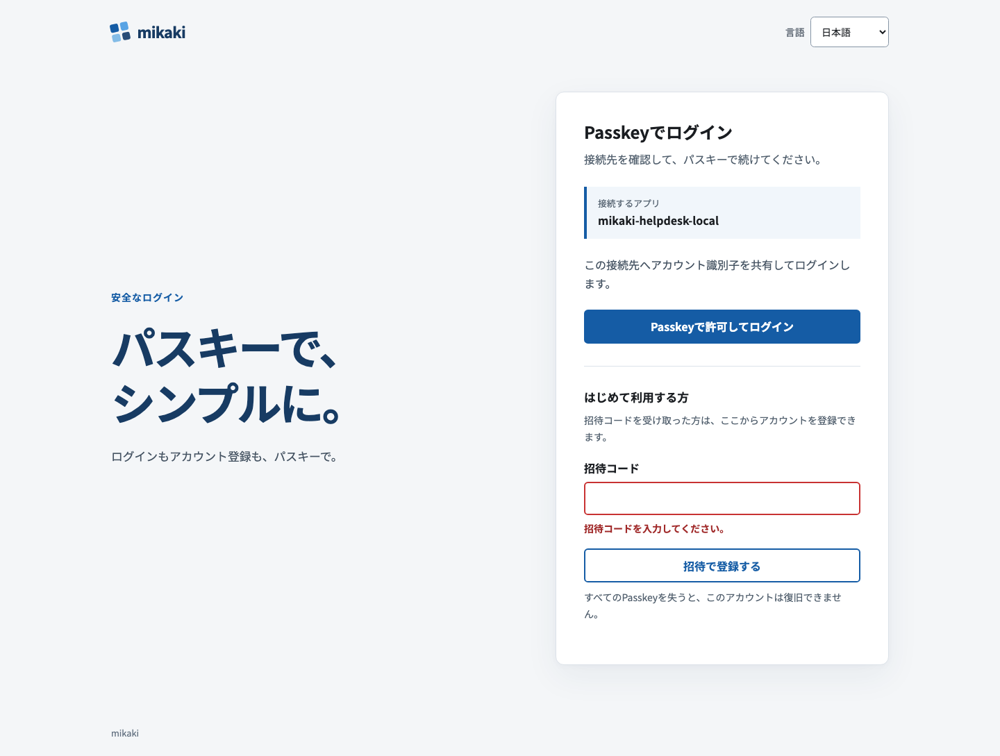

# ログイン画面プレビュー

サンプル接続先 `mikaki-helpdesk-local` を表示して、実際の Worker UI バンドルから撮影した画面です。認証操作とデータは模擬しています。

| ログイン | 初回登録 | 招待コード未入力 |
| --- | --- | --- |
|  |  |  |

[スマートフォン幅のログイン画面](login-ui-preview/mobile-sign-in.png)

共通スタイルは [`auth.css`](../crates/worker/ui/auth.css) に置き、本番 Worker とローカル OP の画面で使用します。接続先、パスキーの操作、招待による登録を順に配置しました。文字組み、ボタンの優先度、入力欄のラベルとエラー表示は、デジタル庁デザインシステムの[タイポグラフィ](https://design.digital.go.jp/dads/foundations/typography/)、[ボタン](https://design.digital.go.jp/dads/components/button/)、[インプットテキスト](https://design.digital.go.jp/dads/components/input-text/)を参考にしています。配色とロゴは mikaki 用です。

再撮影する場合は `worker-build --release crates/worker` の後に `node docs/login-ui-preview/capture.mjs` を実行します。
