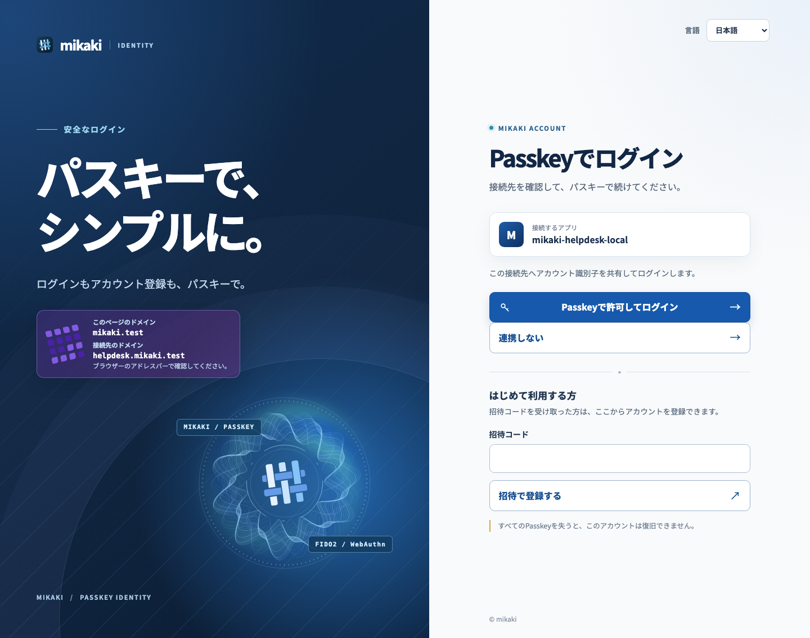
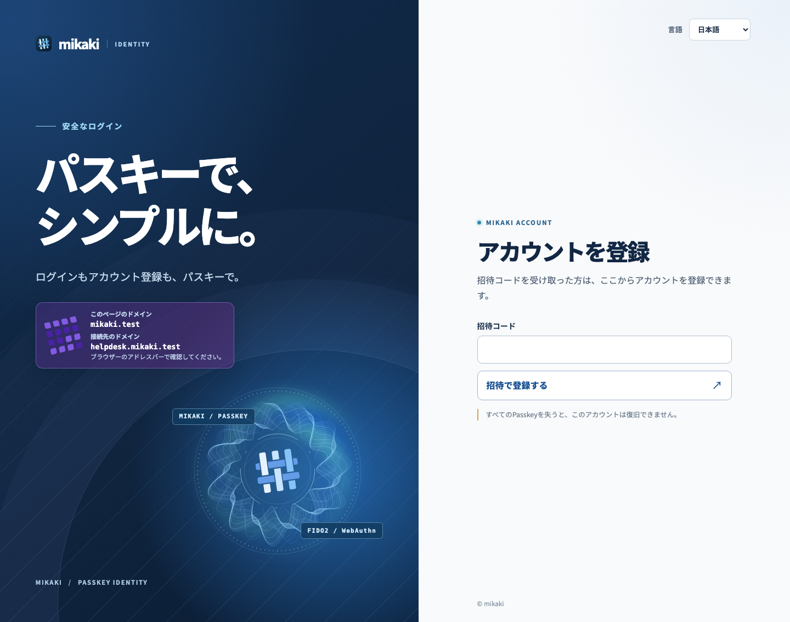
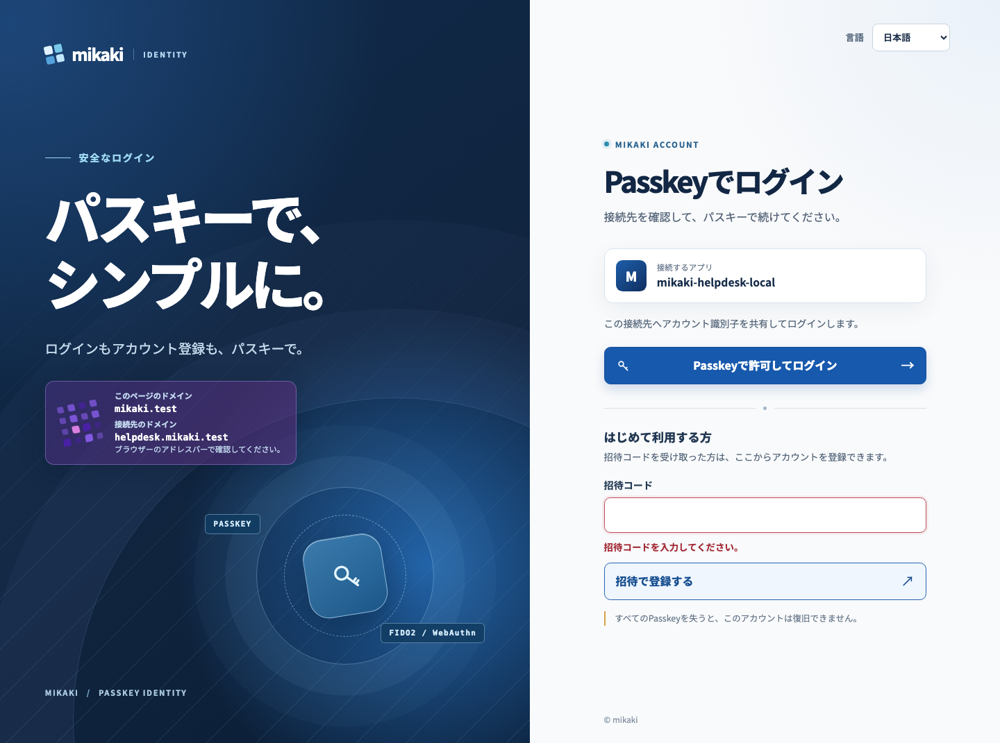

# ログイン画面プレビュー

サンプル接続先 `mikaki-helpdesk-local` を表示して、実際の Worker UI バンドルから撮影した画面です。認証操作とデータは模擬しています。

| ログイン | 初回登録 | 招待コード未入力 |
| --- | --- | --- |
|  |  |  |

[スマートフォン幅のログイン画面](login-ui-preview/mobile-sign-in.png) · [英語表示](login-ui-preview/sign-in-en.png)

ログイン画面のスタイルは [`auth.css`](../crates/worker/ui/auth.css) に置き、本番 Worker とローカル OP の画面で使用します。ブランド面と操作面を分け、接続先の確認、パスキーの操作、招待による登録を順に配置しました。文字組み、ボタンの優先度、入力欄のラベルとエラー表示は、デジタル庁デザインシステムの[タイポグラフィ](https://design.digital.go.jp/dads/foundations/typography/)、[ボタン](https://design.digital.go.jp/dads/components/button/)、[インプットテキスト](https://design.digital.go.jp/dads/components/input-text/)を参考にしています。配色とロゴは mikaki 用です。

左側の模様は現在のページ URI、検証済みの RP `redirect_uri`、ログイン取引の値から描画します。配色は両 URI で決まり、色の並びと動きは取引値にも連動します。さらに `/login/cue` が取引と HttpOnly ブラウザー Cookie を照合し、約 20 秒ごとに短寿命の模様データを返します。取得できない場合もログイン操作には影響せず、最後の模様を維持します。動きを減らす OS 設定では更新とアニメーションを止めます。

両方のドメインを表示し、現在のページのドメインをアドレスバーと照合するよう促します。別ドメインで静的に複製した画面は色や動きが変わりますが、模様やページ内のドメイン表示は中継・偽装できます。真正性の証明ではありません。最終的な確認はアドレスバーとブラウザーの Passkey UI に表示されるドメインで行います。

再撮影する場合は `worker-build --release crates/worker` の後に `node docs/login-ui-preview/capture.mjs` を実行します。
