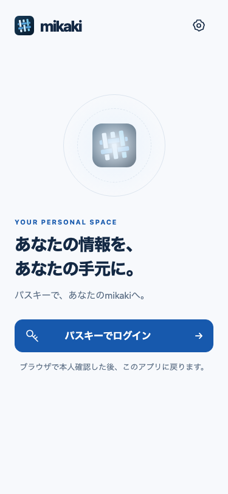
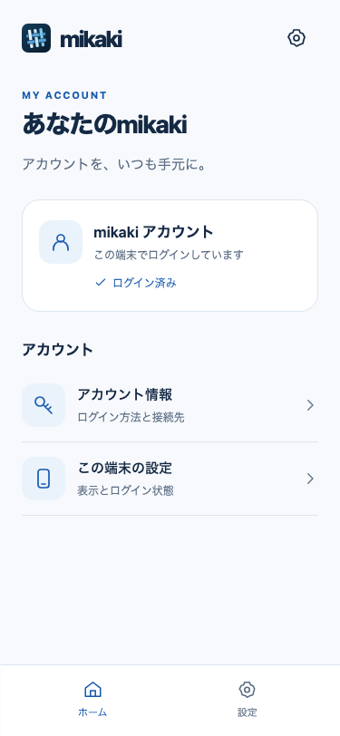
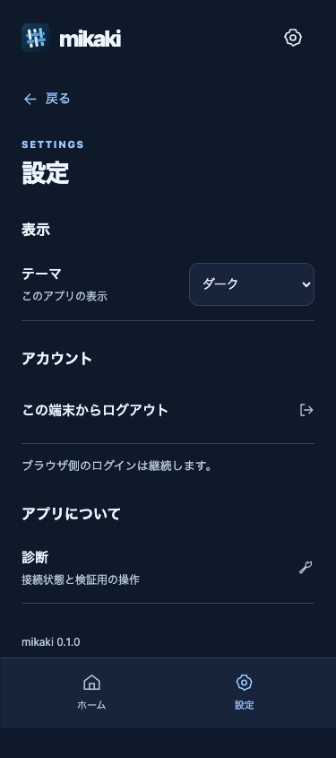

# Native app interface

2026-09-30: the debug landing screen is replaced by a mobile account interface.
These screenshots use the actual bundled HTML/CSS/JS, the app CSP and a synthetic
native bridge at 375 × 812. They contain no real account or token data.

| Entry | Account home | Dark settings |
| --- | --- | --- |
|  |  |  |

[Browser authentication waiting](waiting.png), [light settings](settings.png),
and [diagnostics](diagnostics.png) are also captured.

The account home and settings share bottom navigation. Login starts in the
system browser; completion returns to home. Cancel invalidates the native
pending transaction. Local logout asks for confirmation, preserves the session
on failure, and blocks stale UI responses and history from restoring account
screens after success. Browser SSO remains active. System/light/dark preference
is local to the app; account credentials stay in Rust memory.

Vault preview tools are confined to diagnostics. They check a signing key or
fetch ciphertext when the corresponding native preview/grant is available.
They do not implement decryption or a personal-data browser.

Validation:

- `npm run test:mobile-ui`: six browser scenarios plus their parent test pass,
  covering mobile/desktop cancellation, late responses, session restoration,
  logout failure/success, navigation, theme and diagnostic operations.
- Layout checks cover widths 320, 375, 480 and 1080 without horizontal overflow.
- `cargo test --manifest-path apps/mikaki-client/src-tauri/Cargo.toml --locked --offline`:
  four native tests pass, including cancellation wakeup and rejection of late
  session commits after cancellation/logout.
- `npm run check:node` checks the TypeScript test helpers.

Regenerate with `npm run preview:mobile-ui`. Browser tests use mocked IPC and
cannot qualify a physical Android/iPhone authentication flow.

## Android update

The arm64 release APK was built with the registered public mobile client and
the existing opt-in diagnostic preview. `apksigner verify --print-certs`
confirmed the same verification certificate already installed on the Pixel.
`adb install -r` succeeded without uninstalling or clearing app data. Package
inspection confirms release mode (no DEBUGGABLE flag), arm64 and the callback
domain remains verified.

Initial UI APK SHA-256: `53213b15a50074ec564205f98bb0dd2daee268c45fc0010d1759efcafc0f5ccd`.
The APK stays in ignored build output; signing material and device screenshots
are not included in this directory.

## Physical-device follow-up

On the initial UI build, the unlocked Pixel displayed the signed-in home and
settings in system dark mode. Android Back returned from settings to home;
the content and bottom navigation did not overlap the status or gesture bars.
A new login returned through browser SSO and displayed `ログインしました。` on
the native home. This does not establish observation of a fresh Passkey prompt.

Selecting light appearance exposed insufficient status-icon contrast: the
WebView background changed, but Android retained white status icons. The fix
uses an origin-scoped Android WebMessage listener for the bundled top-level
`tauri.localhost` page, accepting only `light` or `dark`. It changes system-bar
icon appearance and exposes no session or signing-key operations. The native
window reapplies the resolved appearance when focus returns. The corresponding
[Android inset guidance](https://developer.android.com/develop/ui/views/layout/edge-to-edge)
describes setting icon appearance for contrast with edge-to-edge content.

The correction passed all seven browser tests, built successfully, and was
installed with the same certificate via `adb install -r` on 2026-10-01.
Corrected APK SHA-256: `0caee181fe32da9854c863f514c4986b57cb04b2d215bf61e0b184a3fcd0d527`.
On 2026-10-01, the unlocked Pixel verified the corrected build: light appearance
showed black status icons and a dark gesture handle, and dark appearance showed
white status icons and a white gesture handle. The light choice persisted across
the update/reopen. The theme was restored to `端末に合わせる` (system dark on
this device).

Login on the corrected APK displayed the waiting screen, returned through
browser SSO and showed `ログインしました。` on the native home. Account details
opened successfully and Android Back returned to home. The final home retained
correct dark system-bar contrast after the external-browser round trip. The app
was left logged in on home. A fresh Passkey prompt, iPhone and the remaining
physical-device cancellation/timeout/interception cases remain unqualified.
