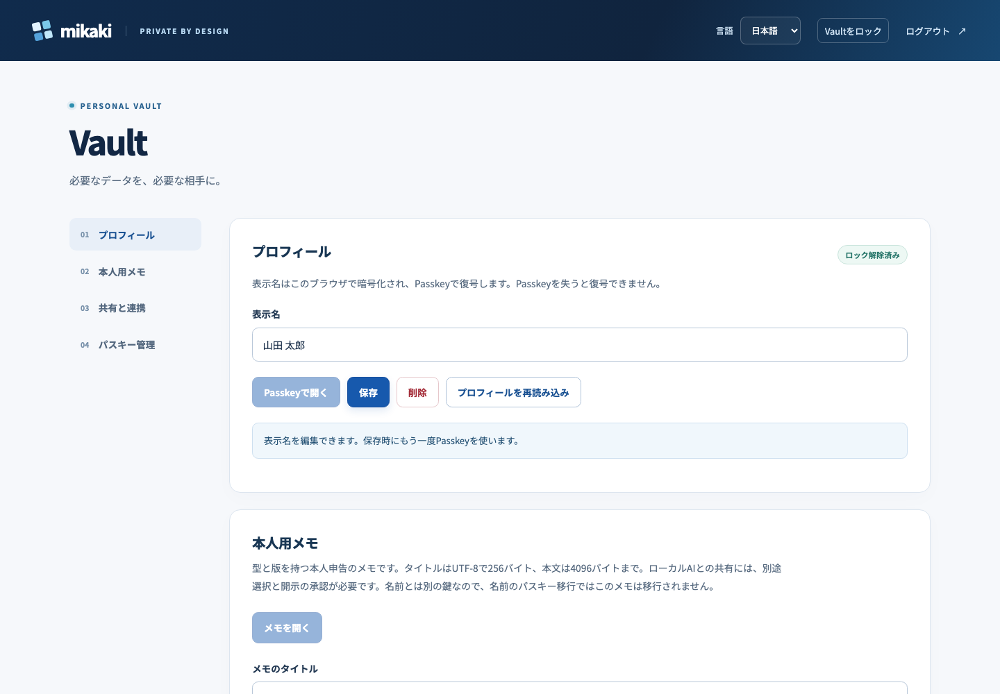
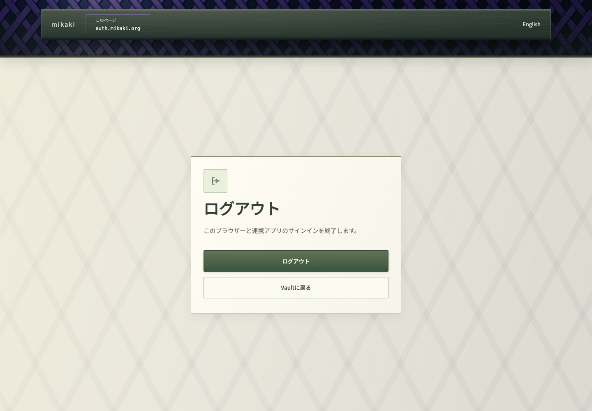

# Product UI preview

Vault, invitation management, and registration completion carry the login/home woven fence into a compact header, with the current host on a metal plaque. The origin determines the weave, color, and grain; pointer movement and ambient light animate the surface, respecting reduced motion. The CSS fallback also uses the origin's color and grain when Canvas is unavailable. Light mineral panels keep the editors readable, and a metal navigation bar stays accessible on mobile. Logout retains its existing navy/blue treatment. Profile operations expose loading and retry state, prevent overlapping mutations, and allow explicit discard/reload after failures. Name/note editors show unsaved changes; voluntary lock, reload, transfer, and initial deletion use confirmation. Browser unload protection is best effort.

| Vault | Logout |
| --- | --- |
|  |  |

[Mobile Vault](product-ui-preview/vault-mobile.png) · [Mobile logout](product-ui-preview/logout-mobile.png) · [English Vault](product-ui-preview/vault-en.png) · [Invitation management](product-ui-preview/admin.png) · [Registration complete](product-ui-preview/complete.png) · [Logout complete](product-ui-preview/logout-complete.png)

[Full Vault](product-ui-preview/vault-full.png) · [Full mobile Vault](product-ui-preview/vault-mobile-full.png) · [Mobile session lock](product-ui-preview/vault-session-locked-mobile.png) · [Unsaved mobile editor](product-ui-preview/vault-draft-mobile.png)

[Passkey settings](product-ui-preview/vault-settings.png) · [Mobile Passkey settings](product-ui-preview/vault-settings-mobile.png)

[Mobile invitation management](product-ui-preview/admin-mobile.png) · [Mobile registration complete](product-ui-preview/complete-mobile.png)

Captured from the actual Worker and UI bundles with disposable synthetic accounts/data and mocked Passkey PRF. These screens have not been deployed as part of this change. They do not qualify intended devices or accessibility certification.

Build with `worker-build --release crates/worker`, then run `npm run preview:product-ui` to refresh these images. The capture checks desktop/375px horizontal overflow, browser exceptions, Vault unlock, the mobile session lock, and logout completion. `npm run test:product-ui` separately runs interaction and failure regressions in CI. See [product quality gates](product-quality.md).

Common styles live in `crates/worker/ui/product.css`, the common header in `ProductHeader.svelte`, and server-rendered logout in `logout.html`. The optional `logout.ts` module notifies other Vault tabs; confirmation/revocation works without it. `VaultSession.svelte` owns the shared display lease and disposal boundary. `/ui/product.css` serves the login base styles plus product styles under same-origin CSP. No database migration is needed for the visual layer; the newer underlying Vault/agent features have separate migration and activation gates.
