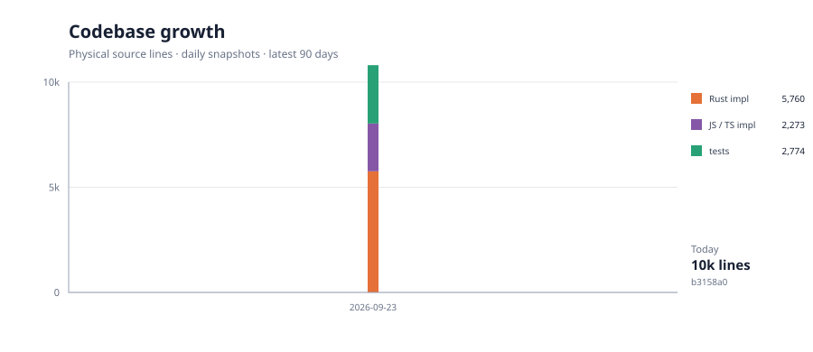
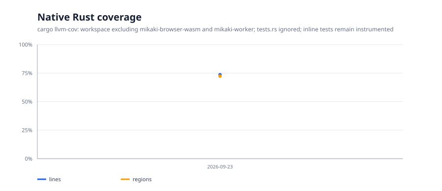

# Project metrics

These charts are refreshed by CI. Pull requests get a current report and charts
as the `authentication-measurements` artifact; pushes to `main` also append a
history point and commit the updated SVGs here.

See the [direct dependency inventory](dependency-inventory.md) for package names and the runtime dependency source-line breakdown.

The size chart tracks only code maintained in this repository. Runtime dependency source is measured in the inventory but omitted from the chart because transitive package source trees overwhelm the project-code trends.

## Measurement scope

- Code size counts physical lines in hand-written `.rs`, `.js`, `.mjs`,
  `.ts`, `.tsx`, `.jsx`, and `.svelte` files under `crates/` and `local/`.
- Test files and Rust `#[cfg(test)]` modules are counted separately from
  implementation. Rust test modules are identified with a brace-counting
  source heuristic; use the graph as a trend, not an exact semantic LOC report.
- Generated output, conformance tooling, examples, design probes, docs, config,
  and vendored/dependency/build directories are excluded.
- Coverage is native Rust `cargo llvm-cov` line and region coverage for the
  workspace, excluding `sakimori-worker` and files matching `tests.rs`. Inline
  unit tests remain part of the instrumented sources. It is not whole-product
  or browser coverage.
- The stacked growth chart adds JavaScript source lines from npm production
  packages and Rust source lines from the resolved `wasm32-unknown-unknown`
  normal-dependency graph. npm package code is counted from installed `node_modules`;
  Cargo source is counted under each resolved crate's `src/`. Rust inline test
  modules are excluded using the same documented heuristic. These are package
  source lines, not the subset that survives bundling or linking.
- The dependency inventory lists unique direct names classified from
  `package.json` and Cargo manifests, plus resolved runtime source lines and
  package/crate counts. It does not represent final bundled or linked binary size.
- History is one snapshot per calendar day. A successful `main` CI run replaces
  that day's row with the latest commit and refreshes the charts.
