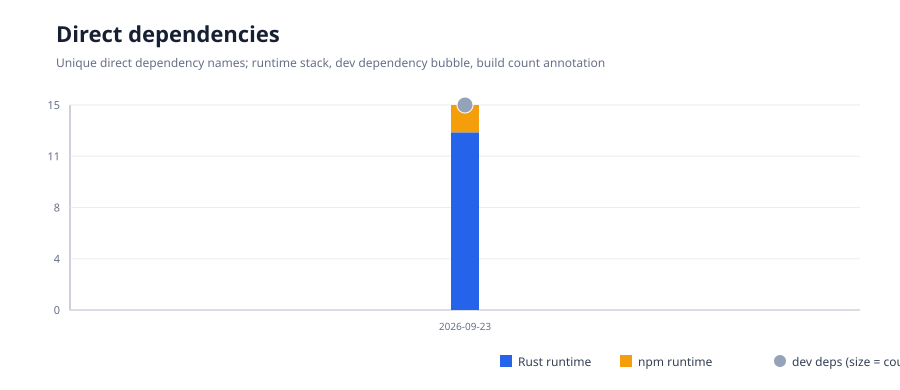

# Project metrics

These charts are refreshed by CI. Pull requests get a current report and charts
as the `authentication-measurements` artifact; pushes to `main` also append a
history point and commit the updated SVGs here.

See the [direct dependency inventory](dependency-inventory.md) for package names.

## Measurement scope

- Code size counts physical lines in hand-written `.rs`, `.js`, `.mjs`,
  `.ts`, `.tsx`, `.jsx`, and `.svelte` files under `crates/` and `local/`.
- Test files and Rust `#[cfg(test)]` modules are counted separately from
  implementation. Rust test modules are identified with a brace-counting
  source heuristic; use the graph as a trend, not an exact semantic LOC report.
- Generated output, conformance tooling, examples, design probes, docs, config,
  and vendored/dependency/build directories are excluded.
- Coverage is native Rust `cargo llvm-cov` line and region coverage for the
  workspace, excluding `sakimori-worker` and files matching `tests.rs`. Inline
  unit tests remain part of the instrumented sources. It is not whole-product
  or browser coverage.
- Dependency charts count unique direct dependency names classified by
  `package.json` and Cargo workspace manifests. Rust build dependencies are
  reported separately; transitive or resolved bundle dependencies are not counted.
