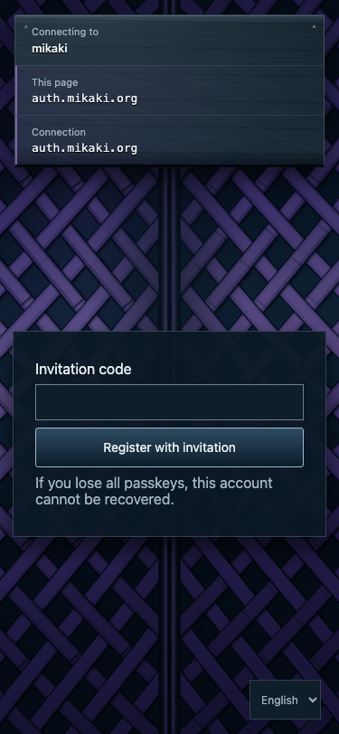
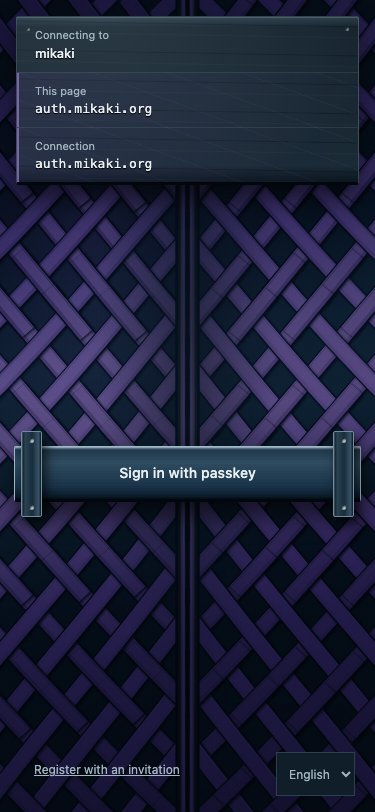
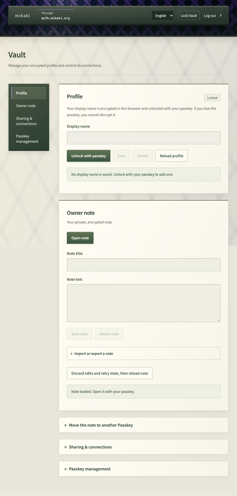

## What mikaki does

mikaki is an open source service for passkey authentication and OpenID Connect sign-in to connected applications. Its Web interface also provides a Vault for your saved name and note. It is experimental, with device compatibility and recovery still under qualification.

## 1. Register with an invitation

New accounts currently require an invitation code. If you have one, open the [registration page](https://auth.mikaki.org/enroll?lang=en) and follow the instructions to create a passkey. The sign-in page does not create a new account without an invitation.

If you do not have a code, see [invitation requests](contact.md) for the request form and information needed.

Passkey creation and storage depend on your device and browser. Check which account and passkey provider you are using. mikaki does not ask you to create a password.

*Public registration screen, October 3, 2026. Enter a code only after receiving an invitation.*

## 2. Sign in on the Web

Open [Web sign-in](https://auth.mikaki.org/signin?lang=en) and authenticate with your registered passkey. You do not need to install the mikaki app to use the Web interface. Check that the authentication screen is on **auth.mikaki.org**.

After sign-in, you enter Vault. Authentication confirms your account; unlocking saved Vault data is a separate operation.

*Public sign-in screen, October 3, 2026. Use the passkey created during registration.*

## 3. Open a saved Vault item

Use the item's unlock action and confirm the passkey. Decryption needs the corresponding passkey used for the saved data and WebAuthn PRF support. Successful ordinary sign-in does not establish that this device and browser can unlock the item.

The screen calls the name “Display name” in “Profile”, and the note “Owner note”. “Unlock with passkey” and “Open note” are separate actions. For a first check, use a short note you can afford to lose, save it and reopen it. [Using Vault](vault.md) explains the screen sections and the steps. Recovery qualification is incomplete, so review the limitations before using Vault as the only copy of information you cannot afford to lose.

For compatibility and unlock troubleshooting, follow the checks in [Passkeys and unlocking Vault](passkeys.md).

*The deployed UI shown with a disposable local demonstration account. Profile and note unlock controls are separate. Follow saving and reopening in [Using Vault](vault.md).*

## 4. Sign in to a connected application

Start from the application's own login action. Check the destination in mikaki's authentication and connection screen before approving it. Signing in to mikaki does not automatically connect an arbitrary application.

Developers should use the [application integration guide](integration.md).

## Web interface and native app

The Web interface runs in your browser. The [mikaki app](https://app.mikaki.org) is being developed for operations that use device capabilities; general distribution is still being prepared. Installing it does not automatically transfer every passkey or unlock all saved Vault data.

For troubleshooting, read the [FAQ](faq.md). For adoption decisions, review [security and implementation status](security.md).

Images use the public UI checked on October 3, 2026. Registration/sign-in were captured from public pages; Vault uses the same deployed UI with synthetic data in an isolated environment. PRF was mocked for capture; these images do not qualify physical devices or production saving/recovery.

## Read next

- [Using Vault](vault.md): Follow the save-and-reopen steps, then review sharing and transfer.
- [Passkeys and unlocking Vault](passkeys.md): Check what to do when sign-in or decryption fails.
