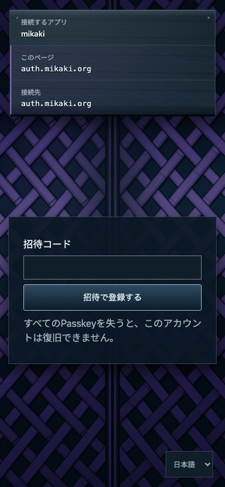
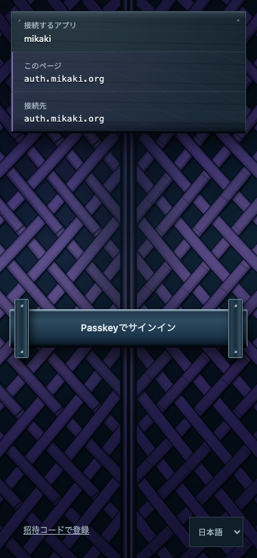
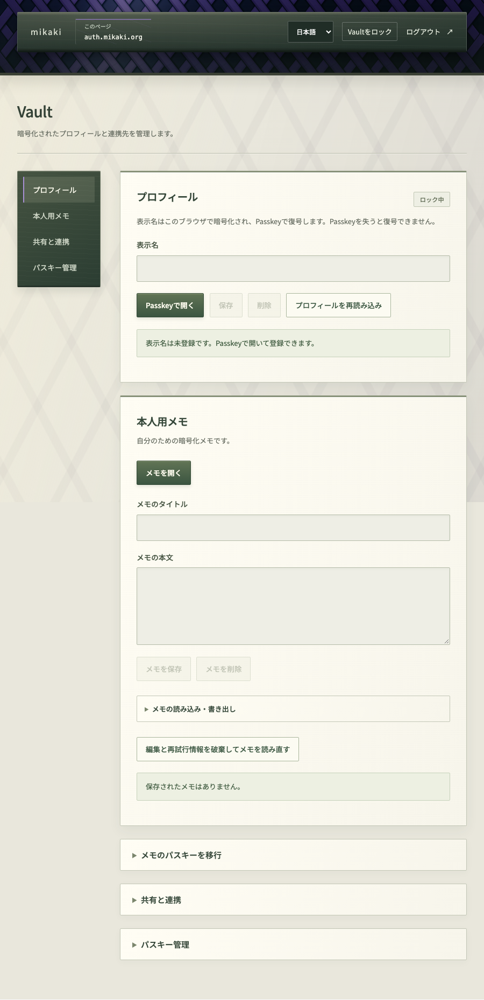

## mikakiでできること

mikakiは、パスキーで本人認証し、連携アプリへOpenID ConnectでログインするOSSのサービスです。Web版では、自分の名前やノートを扱うVault画面へ進めます。実験的なプロジェクトで、対応端末や復旧には検証中の部分があります。

## 1. 招待コードを使って登録する

新しいアカウントの登録には、現在、招待コードが必要です。コードを受け取った方は[登録画面](https://auth.mikaki.org/enroll?lang=ja)を開き、画面の案内に従ってパスキーを作成してください。招待コードがない場合は、サインイン画面だけで新しいアカウントは作成できません。

招待コードをまだ持っていない方は、[招待の相談](contact.md)で依頼先と必要な情報を確認してください。

パスキーの作成・保存方法は端末やブラウザによって異なります。使用するアカウントと、パスキーの保存先を確認してください。mikakiにパスワードを設定する手順はありません。

*公開登録画面（2026年10月3日）。招待コードを受け取ってから、この欄に入力します。*

## 2. Webでサインインする

[Webサインイン](https://auth.mikaki.org/signin?lang=ja)を開き、登録済みのパスキーを選んで認証します。Web版の利用にmikakiアプリのインストールは必要ありません。認証画面のドメインが **auth.mikaki.org** であることを確認してください。

サインイン後はVault画面へ進みます。サインインはアカウントの確認であり、保存済みVaultデータの解錠とは別の操作です。

*公開サインイン画面。ドメインを確認し、端末のパスキー選択画面へ進みます。OS側の画面は端末によって異なります。*

## 3. Vaultを開く

Vaultで保存済みの項目を開くときは、項目の解錠操作でパスキーを確認します。暗号化データを開くには、登録・保存時の対応するパスキーとWebAuthn PRF機能が必要です。通常のログインに成功しても、その端末・ブラウザで解錠できるとは限りません。

画面では、名前は「プロフィール」の「表示名」、ノートは「本人用メモ」と表示されます。「Passkeyで開く」と「メモを開く」は別々の操作です。初めて試すときは、失っても困らない短いメモで、保存してから開き直すところまで確認してください。画面の見方と具体的な手順は[Vaultの使い方](vault.md)にまとめています。復旧方法の検証が完了していないため、失うと困る情報の唯一の保存先として使う前に制約を確認してください。

パスキーの互換性や解錠で困ったときは、[パスキーとVaultの解錠](passkeys.md)の確認手順を参照してください。

*配信中と同じUIを、説明用のローカルアカウントで表示しています。名前とメモの解錠ボタンは別です。保存・開き直しの画像は[Vaultの使い方](vault.md)で確認できます。*

## 4. 連携アプリにログインする

連携先アプリを利用する場合は、そのアプリのログイン操作から始めます。mikakiの認証・接続画面で相手を確認して、接続を承認してください。mikakiにサインインしただけで、任意のアプリと連携できるわけではありません。

自分のアプリを接続したい開発者は[アプリ連携ガイド](integration.md)を参照してください。

## Web版とアプリ版の違い

Web版はブラウザで利用できます。[mikakiアプリ](https://app.mikaki.org)は端末機能を使う操作に向けて開発中で、一般向け配布は準備中です。アプリをインストールすればすべてのパスキーやVaultデータが自動で移行される、という仕組みではありません。

操作につまずいた場合は[よくある質問](faq.md)、導入判断には[セキュリティと対応状況](security.md)を確認してください。

画像は2026年10月3日の公開UIを基にしています。登録・ログイン画面は公開ページ、Vaultは同じ配信UIと合成データを使う分離環境で撮影しました。パスキーのPRF操作は撮影用に模擬しており、実端末や本番での保存・復旧を検証した画像ではありません。

## 次に読む

- [Vaultの使い方](vault.md)：保存して開き直す手順、共有、移行を確認します。
- [パスキーとVaultの解錠](passkeys.md)：ログインや解錠につまずいたときの確認順序を説明します。
